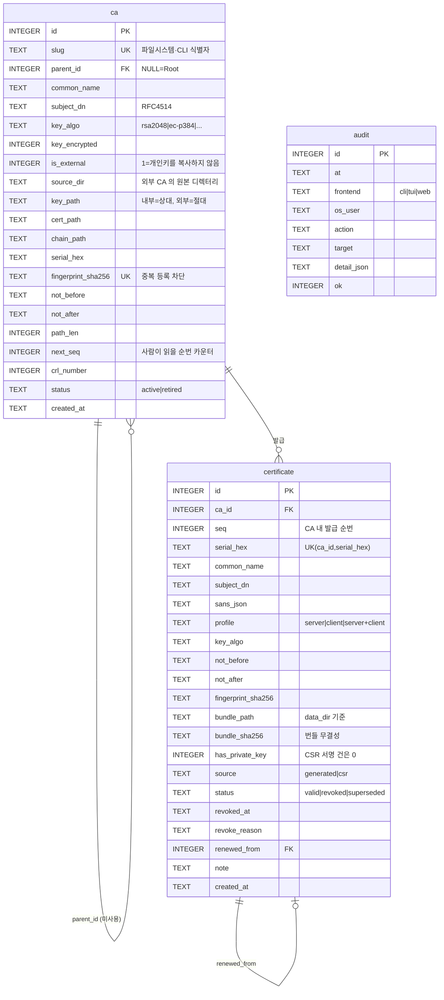
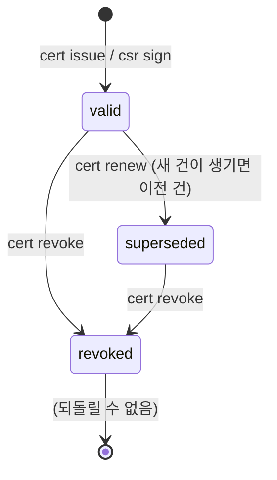
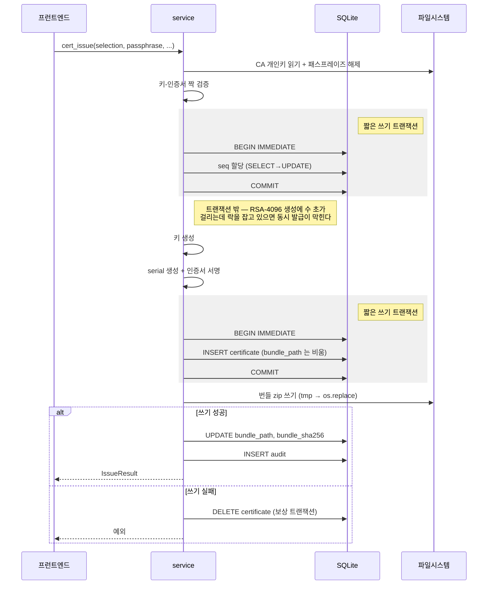
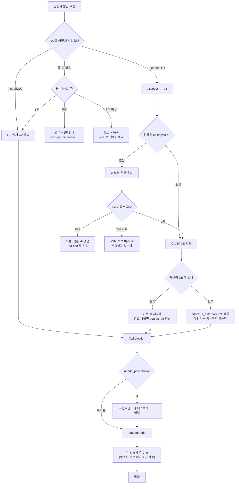

# 데이터 모델

## 저장 위치

```
/var/lib/cert-gen/            0750  certgen:certgen
├── cert-gen.sqlite3          0640  발급 이력·serial·감사 로그 (단일 출처)
├── ca/<slug>/
│   ├── ca.key                0600  cert_gen 이 소유한 CA 개인키 (기본 암호화 PKCS#8)
│   ├── ca.crt                0644
│   └── chain.pem             0644  가져온 CA 가 중간 CA 인 경우
├── bundles/<YYYY>/<id>-<cn>-<serial8>.zip   0600  발급 결과 (개인키 포함)
├── crl/<slug>.crl            0644
├── backups/*.tar.gz          0600  CA 개인키 포함 — 파일 하나가 CA 그 자체
└── tmp/                            원자적 쓰기용 (같은 파일시스템이어야 os.replace 성립)
```

**외부 CA(`is_external=1`)의 개인키는 이 트리에 없다.** `ca.key_path` 가 절대경로로
원래 위치를 가리킨다.

## 스키마 (SQLite)

`PRAGMA journal_mode=WAL`, `foreign_keys=ON`, `busy_timeout=10000`, `synchronous=FULL`.

> `RETURNING`(3.35+)·`STRICT`(3.37+) 같은 신문법은 쓰지 않는다. Rocky Linux 9 의 SQLite 가
> **3.34.1** 이라 대상 OS 에서 syntax error 가 난다.



인덱스: `certificate(common_name)`, `certificate(not_after)`, `certificate(ca_id, status)`,
`audit(at)`.

### 상태 전이



`superseded` 와 `revoked` 를 구분하는 이유: 갱신은 정상 운영이고 폐기는 사고 대응이다.
CRL 에는 `revoked` 만 들어간다.

## serial 과 순번

둘을 분리한다.

| | 값 | 생성 | 용도 |
|---|---|---|---|
| `serial_hex` | 160비트 난수 | `x509.random_serial_number()` | 인증서의 실제 serial. RFC 5280 요구(양수·20옥텟 이하·충분한 엔트로피)를 라이브러리가 보장 |
| `seq` | CA 별 1,2,3… | `BEGIN IMMEDIATE` 안에서 SELECT→UPDATE | "세 번째로 발급한 것" 을 사람이 알 수 있게 |

난수 serial 만으로는 발급 순서를 알 수 없고, 순번만으로는 예측 가능해서 안 된다.

## 발급 트랜잭션 순서

긴 CPU 작업(키 생성·서명)을 트랜잭션 밖으로 빼고, DB 커밋을 파일 쓰기보다 앞세운다.



순서를 뒤집으면 어떻게 되는가:

- 번들을 먼저 쓰고 INSERT 하면 → 실패 시 **DB 에 없는 고아 zip** 이 남는다(추적 불가).
- 지금 순서에서 최악은 "행은 있는데 zip 이 없다" 이고, 그건 `cert show` 가 명확히 알려준다.

## CA 선택 2경로



암호화된 외부 키는 `discover` 단계에서 공개키를 대조할 수 없다(복호화가 필요하다).
그래서 짝 검증을 `load_material` 로 미뤘다 — 잘못 짝지어진 경우 여기서 반드시 걸린다.
