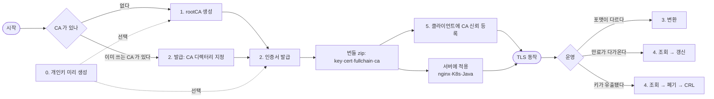
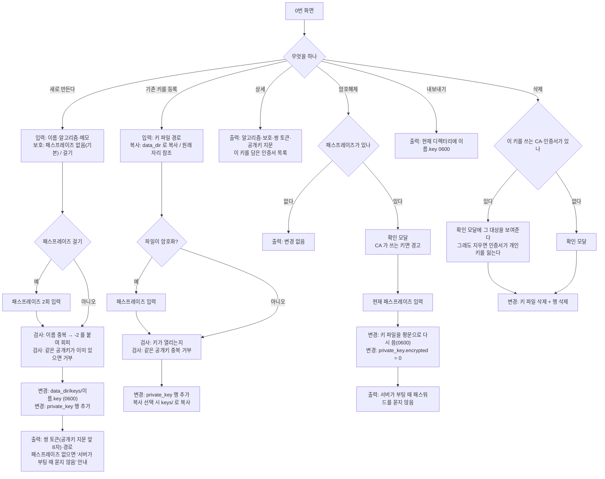
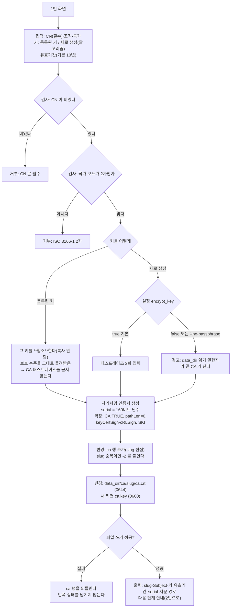
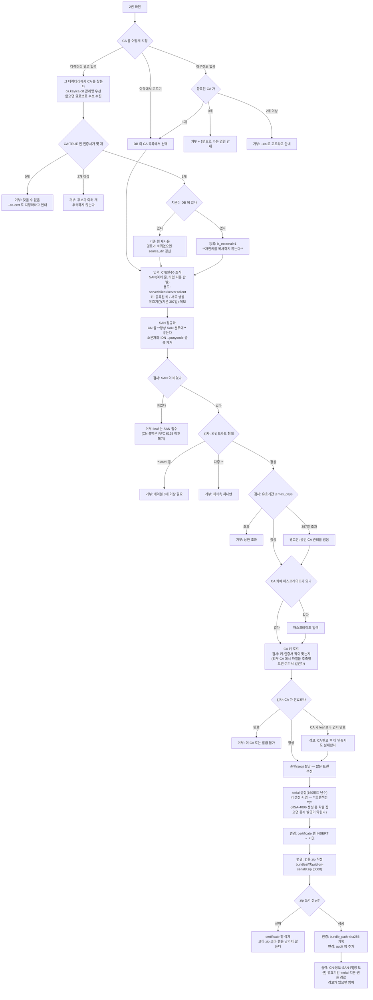
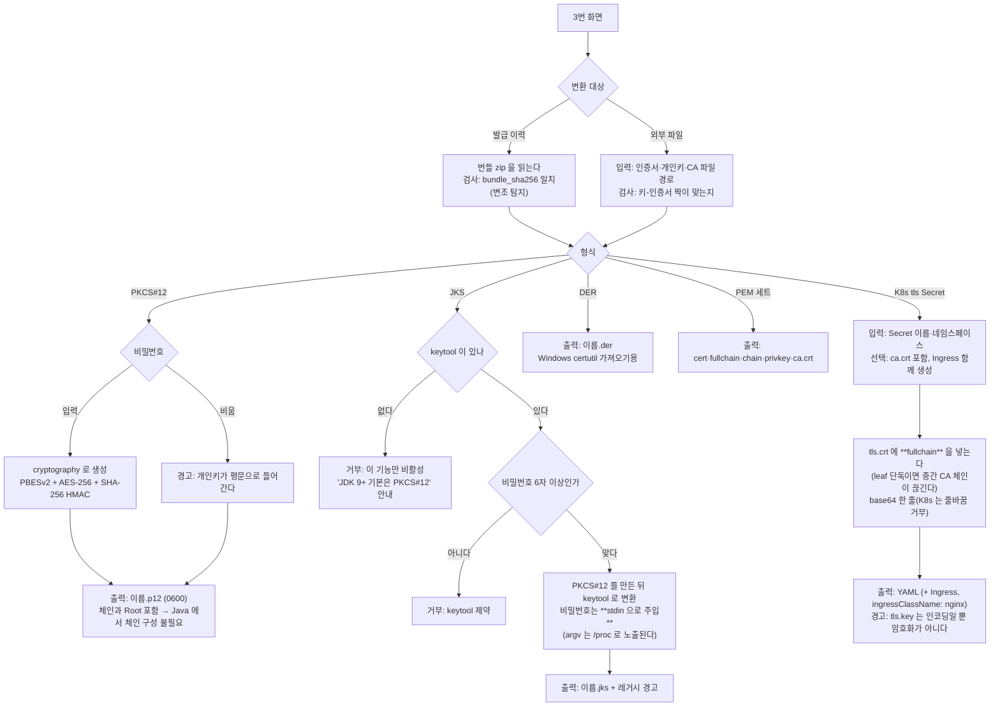
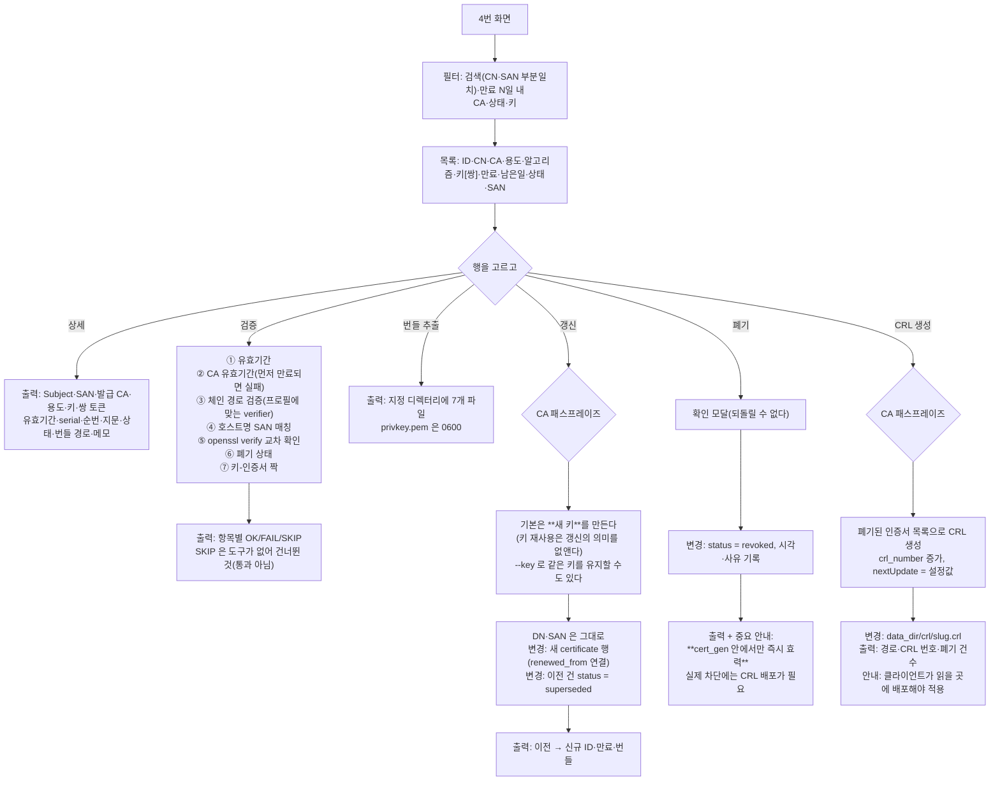
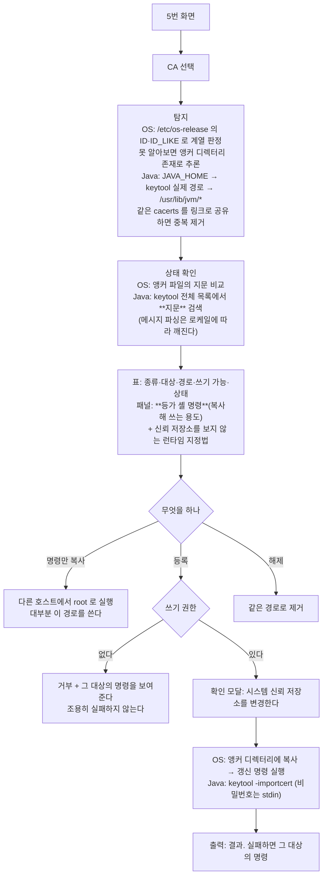
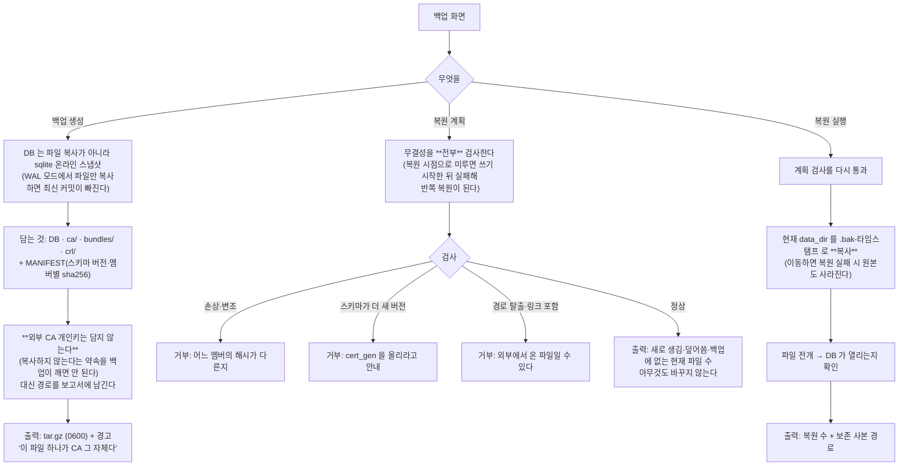

# 메뉴별 동작 흐름

메뉴를 고르면 **무엇을 입력받고 → 무엇을 검사하고 → 어떤 파일·DB 가 바뀌고 → 무엇이 나오는지**
를 적었다. 코드를 보지 않고 동작을 파악하는 것이 목적이다.

읽는 방법:

- `입력` 사용자가 채우는 값
- `검사` 틀리면 여기서 멈춘다(무엇이 왜 거부되는지)
- `변경` 디스크·DB 에 실제로 생기는 변화
- `출력` 화면에 나오는 것, 만들어지는 파일

TUI 와 CLI 는 같은 동작을 한다(둘 다 `service.py` 를 호출한다). 각 절 끝에 등가 CLI 를 적었다.

```
0. 개인키 생성·관리     키를 미리 만들어 두고 1·2 에서 골라 쓴다
1. rootCA 생성          서명할 CA 를 만든다
2. 인증서 발급          CA 로 서버·클라이언트 인증서를 만든다
3. 인증서 변환          PEM → PKCS#12 / JKS / DER / K8s Secret
4. 발급 이력·만료 조회   목록에서 상세·검증·갱신·폐기·CRL
5. 서버에 CA 신뢰 등록   OS·Java 신뢰 저장소에 등록(+등가 명령)
   환경 점검            무엇이 되고 무엇이 안 되는지
   백업 / 복원          CA 개인키를 포함한 전체 백업
```

## 전체 지도

처음 쓰는 사람의 경로는 **1 → 2 → 5** 다. 0 번은 선택이고, 3·4 는 운영 중에 쓴다.



---

## 0. 개인키 생성·관리

키 생성과 인증서 발급의 **수명이 다르다**. 같은 키로 여러 번 갱신해야 하거나(장비가 키 교체를
못 받는 경우), 키를 먼저 만들어 검토한 뒤 발급만 따로 하는 경우에 쓴다.
생략하면 발급할 때 즉석 생성된다 — 그래도 아무 문제 없다.



### 알아둘 것

- **서버에 올릴 키는 패스프레이즈를 걸지 않는 것이 기본**이다. 걸면 nginx·Tomcat 이 부팅할
  때마다 패스워드를 묻고 무인 재시작이 깨진다. 보호는 파일 권한(0600)과 호스트 접근 통제다.
- 등록된 키로 CA 를 만들면 그 키를 **복사하지 않고 참조**한다. 그래서 암호해제가 그 CA 에도
  즉시 반영된다(상태가 갈라지지 않는다).
- 원래 자리를 참조(`--no-copy`)하면 그 경로가 사라지면 쓸 수 없다. 백업에도 담기지 않는다.

```bash
cert-gen key create --name web-key --algo rsa2048     # 패스프레이즈 없음
cert-gen key create --name ca-key --passphrase-stdin  # 걸기
cert-gen key import /path/to/existing.key --name legacy [--no-copy]
cert-gen key list / show <이름> / export <이름> / strip <이름> / delete <이름>
```

---

## 1. rootCA 생성

서명할 주체를 만든다. 한 번 만들면 계속 쓴다.



### 알아둘 것

- CN 은 호스트명이 아니라 **조직을 알아볼 이름**으로 둔다(예: `hd Root CA`). 클라이언트의
  신뢰 목록에 이 이름이 보인다.
- 앱에 로그인이 없다 → **CA 키 패스프레이즈가 사실상 유일한 서명 권한 통제**다.
- 중간 CA 는 만들지 않는다(Root → leaf 1단계). 단 **남이 만든 중간 CA 는 2번에서 쓸 수 있다**.

```bash
cert-gen ca create --cn "hd Root CA" --o HD --c KR    # 새 키 + 패스프레이즈
cert-gen ca create --cn "hd Root CA" --key ca-key     # 등록된 키 사용
cert-gen ca create --cn "hd Root CA" --no-passphrase  # 패스프레이즈 없이
cert-gen ca adopt --dir /srv/pki/mycorp               # 외부 CA 를 복사 없이 등록
cert-gen ca import --key ca.key --cert ca.crt         # data_dir 로 복사해 등록
```

---

## 2. 인증서 발급

가장 많이 쓰는 화면. **CA 선택이 두 갈래**인 것이 핵심이다.



### 번들 zip 내용

발급 결과를 파일 여러 개로 흩뿌리지 않는다. 흩어지면 어느 키가 어느 인증서의 짝인지 잃는다.

| 파일 | 내용 | 서버 설정에 쓰는 것 |
|---|---|---|
| `privkey.pem` | 개인키(패스프레이즈 없음) | ✔ |
| `cert.pem` | 이 서비스의 인증서 | |
| `chain.pem` | 상위 CA 체인(Root 제외). Root 직접 발급이면 없음 | |
| `fullchain.pem` | `cert.pem` + `chain.pem` | ✔ 보통 이것 |
| `ca.crt` | Root CA | 클라이언트 신뢰 등록용 |
| `metadata.json` | DN·SAN·알고리즘·유효기간·지문·발급시각 | |
| `USAGE.txt` | OS 별 신뢰 등록, nginx·NPM·K8s·Java 적용 예 | |

zip 안의 `privkey.pem` 에 0600 을 심어 둔다 — `unzip` 이 그 권한을 복원하므로 받은 쪽에서
chmod 를 잊어도 개인키가 0644 로 풀리지 않는다.

```bash
cert-gen cert issue --ca hd-root-ca --cn web.example.com --san 10.0.0.5 --san '*.web.example.com'
cert-gen cert issue --ca-dir /srv/pki/mycorp --cn api.example.com     # 외부 CA
cert-gen cert issue --ca hd-root-ca --key web-key --cn web.example.com # 미리 만든 키
cert-gen cert bundle <ID> -o /etc/nginx/tls                            # 파일로 꺼내기
```

---

## 3. 인증서 변환

**대상이 두 갈래**다(2번의 CA 선택과 같은 대칭). 실무에서 변환을 가장 많이 쓰는 경우가
"남이 준 PEM 을 p12 로" 이므로 외부 파일 경로도 받는다.



### 어떤 포맷을 쓰나

| 쓰는 곳 | 포맷 |
|---|---|
| nginx·Apache·HAProxy·Nginx Proxy Manager | PEM (`fullchain.pem` + `privkey.pem`) |
| Kubernetes Ingress | tls Secret YAML |
| Java (Tomcat·Spring Boot·Kafka·Elasticsearch) | **PKCS#12** |
| JKS 를 명시적으로 요구하는 레거시 | JKS |
| Windows 인증서 저장소·일부 장비 | DER |

```bash
cert-gen export p12 <ID> -o web.p12
cert-gen export jks <ID> -o web.jks
cert-gen export k8s <ID> --secret-name web-tls --namespace production --with-ca
cert-gen export p12 --cert cert.pem --key privkey.pem --ca-file ca.crt -o out.p12
```

---

## 4. 발급 이력·만료 조회

실제 사용 빈도가 가장 높은 화면이다. 발급보다 "지금 뭐가 있고 언제 만료되나" 를 더 자주 본다.



### 상태 세 가지

| 상태 | 언제 | CRL 에 들어가나 |
|---|---|---|
| `valid` | 정상 | |
| `superseded` | 갱신해서 새 건이 생김(정상 운영) | 아니오 |
| `revoked` | 사고 대응으로 폐기 | **예** |

`superseded` 와 `revoked` 를 나눈 이유는 갱신이 사고가 아니기 때문이다.

### 키-인증서 쌍 보기

공개키 지문 앞 8자를 **쌍 토큰**으로 키와 인증서 양쪽에 같게 표시한다. 토큰이 같으면 같은
개인키다.

```
key list :  web-key  rsa2048  없음  808cfb83  짝 인증서 2건
cert list:  3  web.example.com  ...  web-key 808cfb83
            2  api.example.com  ...  (즉석) 9616b4b7
```

```bash
cert-gen cert list --expiring-in 30 / --search 10.0.0.5 / --key web-key
cert-gen cert show <ID> [--pem|--text]
cert-gen cert verify <ID> --hostname web.example.com
cert-gen cert renew <ID> [--key <이름>]
cert-gen cert revoke <ID> --reason keyCompromise
cert-gen crl generate <CA-slug>
```

---

## 5. 서버에 CA 신뢰 등록

자가서명 체인은 **접속하는 쪽이 CA 를 신뢰해야** 동작한다. 그 절차가 OS 계열마다 다르고
Java 는 별도 저장소를 쓴다.



### 계열별 경로

| 계열 | 앵커 디렉터리 | 갱신 명령 |
|---|---|---|
| RHEL·Rocky·Alma·Fedora | `/etc/pki/ca-trust/source/anchors` | `update-ca-trust extract` |
| Debian·Ubuntu | `/usr/local/share/ca-certificates` | `update-ca-certificates` |
| SUSE | `/etc/pki/trust/anchors` | `update-ca-certificates` |
| Alpine | `/usr/local/share/ca-certificates` | `update-ca-certificates` |
| Java | `cacerts` (JAVA_HOME 등에서 탐지) | keytool 이 즉시 반영 |

앵커 파일명·keytool alias 는 `cert-gen-<ca-slug>` 다(다른 CA 와 섞이지 않게).

### 신뢰 저장소를 보지 않는 런타임

OS·Java 저장소에 등록해도 이쪽은 따로 지정해야 한다. 화면이 경로까지 채워 보여준다.

```
REQUESTS_CA_BUNDLE   Python requests/httpx
NODE_EXTRA_CA_CERTS  Node.js
curl --cacert         일회성
git http.sslCAInfo    Git
```

```bash
cert-gen ca trust <slug>                      # 조회 + 등가 명령 (변경 없음)
sudo cert-gen ca trust <slug> --apply         # 등록
cert-gen ca trust <slug> --apply --remove     # 해제
```

---

## 환경 점검

무엇이 되고 무엇이 안 되는지를 한 화면에 모은다. 문제를 추측하기 전에 여기를 본다.

| 항목 | FAIL 이면 |
|---|---|
| 설정 파일 | 경로·문법 확인 |
| data_dir / DB | `cert-gen init` |
| data_dir 쓰기 권한 | 실행 계정 확인 |
| data_dir 권한 | `init` 이 0750 으로 조인다 |
| SQLite | 3.8 이상 필요 |
| openssl *(선택)* | 교차 검증만 건너뜀 |
| keytool *(선택)* | JKS 내보내기만 비활성 |
| CA 개인키 암호화 | `false` 면 data_dir 읽기 권한자가 곧 CA |
| 등록된 CA / CA 키 존재 | 외부 CA 경로가 마운트됐는지 |
| 발급 인증서 / 30일 내 만료 | 갱신 대상 |

선택 항목은 없어도 나머지가 모두 동작한다. 그래서 `SKIP` 을 `OK` 와 구분해 표시한다.

---

## 백업 / 복원



### 복원되지 않는 것

| 항목 | 이유 | 대응 |
|---|---|---|
| 외부 CA 개인키 | `data_dir` 밖이라 담지 않는다 | 따로 백업하고 같은 경로에 둔다 |
| `/etc/cert-gen/config.toml` | 호스트 설정이라 담지 않는다 | 수정했다면 따로 보관 |
| CA 패스프레이즈 | 저장하지 않는다 | 비밀 관리 체계에 보관 |

**패스프레이즈를 잃으면 CA 키를 복구할 수 없다.** 백업만으로는 부족하다.

```bash
cert-gen backup create
cert-gen backup restore <파일> --dry-run    # 무결성 검사 포함, 변경 없음
cert-gen backup restore <파일>
```

---

## 공통 규칙

읽다가 "왜 이렇게 동작하지?" 싶을 때 여기를 보면 대부분 답이 있다.

| 규칙 | 이유 |
|---|---|
| CN 을 항상 SAN 에 넣는다 | CN 만 있는 인증서는 현대 클라이언트가 거부한다(RFC 6125) |
| leaf 에 SAN 이 없으면 발급을 거부한다 | 위와 같은 이유. 발급 시점에 막는 편이 낫다 |
| 비밀값을 명령행 인자로 받지 않는다 | `/proc/<pid>/cmdline` 으로 같은 호스트의 다른 사용자에게 노출된다 |
| 서버용 키는 패스프레이즈 없음이 기본 | 걸면 서버가 부팅할 때마다 패스워드를 묻는다 |
| CA 키는 암호화가 기본 | 서명할 때만 쓰이고, 앱 인증이 없어 이것이 유일한 통제다 |
| 개인키 파일은 0600, 권한을 먼저 좁힌 뒤 쓴다 | 만든 다음 chmod 하면 그 사이에 읽힐 수 있다 |
| DB 커밋 → 그 다음 파일 쓰기 | 역순이면 DB 에 없는 고아 파일이 남아 추적이 안 된다 |
| 키 생성·서명은 트랜잭션 밖에서 | RSA-4096 생성 중 쓰기 락을 잡으면 동시 발급이 모두 막힌다 |
| 추측하지 않고 거부한다 | 외부 CA 후보가 여러 개면 고르지 않고 지정하라고 안내한다 |
| `SKIP` 을 `OK` 와 구분한다 | 도구가 없어 건너뛴 것을 통과로 보이면 안 된다 |
| 폐기는 CRL 을 배포해야 효력이 있다 | 그 사실을 감추면 "폐기했는데 왜 접속되나" 가 된다 |
| 자가서명은 클라이언트에 `ca.crt` 등록이 전제 | 5번 화면이 그 절차를 담당한다 |
